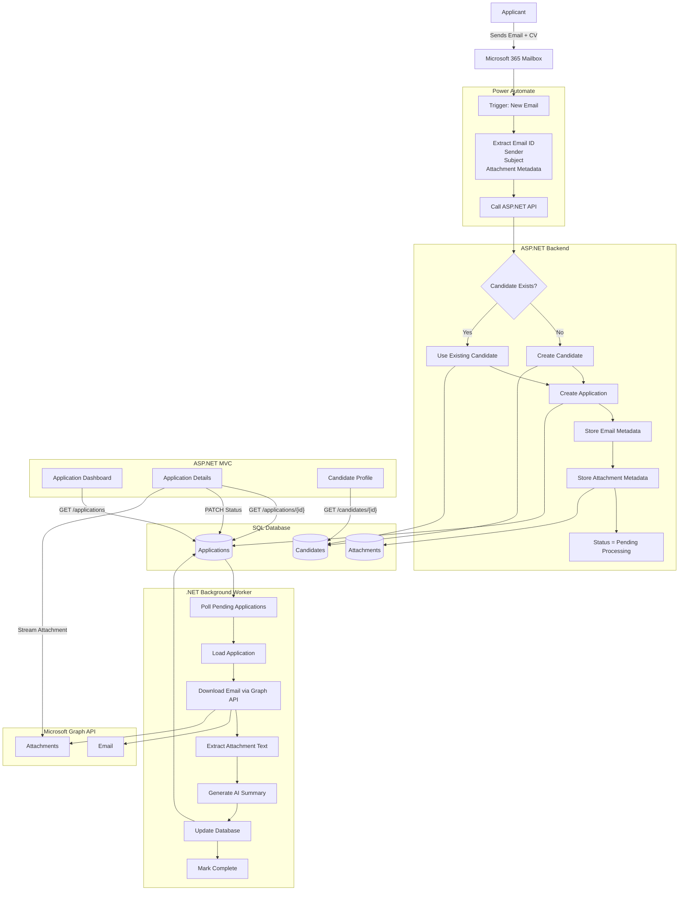

```mermaid
flowchart TD

%% Applicant
A[Applicant] -->|Sends Email + CV| B[Microsoft 365 Mailbox]

%% Power Automate
subgraph PA["Power Automate"]
    C[Trigger: New Email]
    D[Extract Email ID<br/>Sender<br/>Subject<br/>Attachment Metadata]
    E[Call ASP.NET API]

    C --> D
    D --> E
end

B --> C

%% ASP.NET Backend
subgraph API["ASP.NET Backend"]

    F{Candidate Exists?}
    G[Create Candidate]
    H[Use Existing Candidate]

    I[Create Application]
    J[Store Email Metadata]
    K[Store Attachment Metadata]
    L[Status = Pending Processing]

    F -->|No| G
    F -->|Yes| H

    G --> I
    H --> I
    I --> J
    J --> K
    K --> L

end

E --> F

%% Database
subgraph DB["SQL Database"]

    CAND[(Candidates)]

    APP[(Applications)]

    ATT[(Attachments)]

end

G --> CAND
H --> CAND
I --> APP
K --> ATT

%% Background Worker
subgraph WORKER[".NET Background Worker"]

    M[Poll Pending Applications]
    N[Load Application]
    O[Download Email via Graph API]
    P[Extract Attachment Text]
    Q[Generate AI Summary]
    R[Update Database]
    S[Mark Complete]

    M --> N
    N --> O
    O --> P
    P --> Q
    Q --> R
    R --> S

end

APP --> M
R --> APP

%% Microsoft Graph
subgraph GRAPH["Microsoft Graph API"]

    GMAIL[Email]
    GATT[Attachments]

end

O --> GMAIL
O --> GATT

%% MVC Frontend
subgraph UI["ASP.NET MVC"]

    U1[Application Dashboard]
    U2[Application Details]
    U3[Candidate Profile]

end

U1 -->|GET /applications| APP
U2 -->|"GET /applications/{id}"| APP
U2 -->|PATCH Status| APP
U3 -->|"GET /candidates/{id}"| CAND
U2 -->|Stream Attachment| GATT
```
